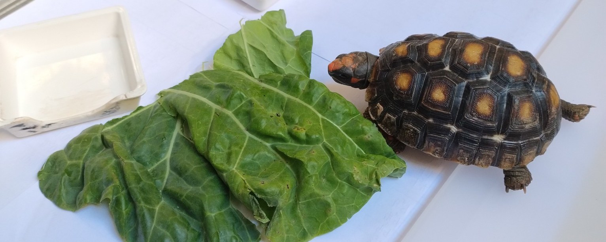
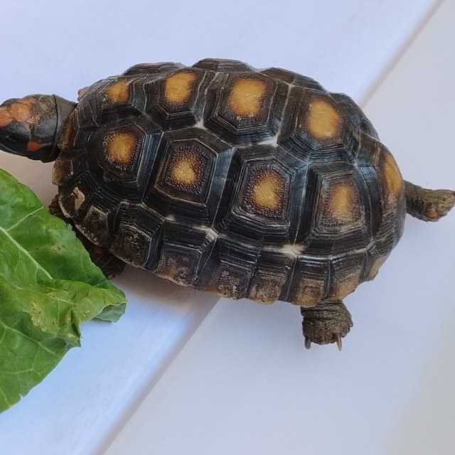

<div align="center">



# Matheus Antonio Vivas Rocha


**[Sobre](#-sobre-mim)** &nbsp;·&nbsp; **[Projetos](#-projetos)** &nbsp;·&nbsp; **[Stack](#-stack)** &nbsp;·&nbsp; **[GitHub](#-github)**

<!-- gravatar:links -->
[](https://www.linkedin.com/in/matheusvivasr)
<!-- /gravatar:links -->
[](https://twitter.com/matheusvivasr)
[](mailto:vivas.matheus@usp.br)


📍 <!-- gravatar:location -->São Carlos - SP<!-- /gravatar:location -->

</div>

---

## 👋 Sobre mim



**Engenharia Elétrica @ EESC‑USP**, focado em **sistemas de potência computacionais**. Gosto de resolver de **ponta a ponta** — do modelo matemático ao ferro na parede — e mantenho bibliotecas open‑source em Python para os simuladores do setor elétrico brasileiro (**ANAREDE** e **ANATEM**, do CEPEL).

- ⚡ Simulação de **sistemas de potência** (ANATEM / ANAREDE)
- 🔌 Firmware **ESP32** — ESP‑NOW, sensores, deep sleep
- 🧮 Ferramentas para **HP Prime** (linguagem PPL)
- 🐢 Até o abrigo da **Faustina** 🐢 virou projeto de ESP32
- 🦈 **Pull Shark** — PRs mesclados em outros projetos
- 💬 Fale comigo sobre **potência, simulação, Python ou embarcados**

<br clear="right" />

---

## 🚀 Destaque — `pynatem`

[](https://pypi.org/project/pynatem/)
[](https://github.com/matheusvivasr/pynatem/blob/main/LICENSE)
[](https://github.com/matheusvivasr/pynatem)
[](https://github.com/matheusvivasr/pynatem)

Biblioteca Python para **gerar, manipular e fazer parsing** de arquivos de caso (`.stb`) do **ANATEM/CEPEL**. Modela o `.stb` como um **grafo de blocos serializáveis** (padrão *AST + Serializer*) — máquinas síncronas, reguladores, PSS, FACTS, HVDC, OLTC — com *roundtrip* fiel ao **Manual 12.10 do CEPEL**.

```bash
pip install pynatem
```

🔗 [github.com/matheusvivasr/pynatem](https://github.com/matheusvivasr/pynatem) &nbsp;·&nbsp; 📦 [pypi.org/project/pynatem](https://pypi.org/project/pynatem/)

---

## 📂 Projetos

**⚡ Sistemas de Potência & Simulação**
- **[pynatem](https://github.com/matheusvivasr/pynatem)** — geração/parsing de casos `.stb` do ANATEM, *roundtrip* fiel ao Manual CEPEL (no PyPI)
- **[newton-powerflux](https://github.com/matheusvivasr/newton-powerflux)** — fluxo de potência por Newton‑Raphson, compatível com o padrão ANAREDE

**🔌 Hardware & Embarcados**
- **[caixa-dagua](https://github.com/matheusvivasr/caixa-dagua)** — nível de caixa d'água **sem contato**: 2× ESP32‑C3, sensores capacitivos, ESP‑NOW + deep sleep, site em tempo real
- **[basking-spot](https://github.com/matheusvivasr/basking-spot)** — controle térmico e de fotoperíodo do recinto da Faustina: ESP32‑S3, NTC10K, SSR 220 V, *fail‑safe*

**🧰 Ferramentas & DevTools**
- **[hp-prime-ppl](https://github.com/matheusvivasr/hp-prime-ppl)** — extensão de VS Code para a linguagem **PPL** (realce, linter, ~700 comandos)
- **[hp-prime-automation](https://github.com/matheusvivasr/hp-prime-automation)** — automação do HP Connectivity Kit / Virtual Calculator (pyautogui)
- **[Conversor-de-Unidades](https://github.com/matheusvivasr/Conversor-de-Unidades)** — conversor de unidades em Python (GTK+ / Glade)
- **[SEL0456](https://github.com/matheusvivasr/SEL0456)** · **[CalcNum](https://github.com/matheusvivasr/CalcNum)** — códigos de disciplinas da EESC‑USP

---

## 💻 Stack


---

## 📊 GitHub

<div align="center">


<br>

</div>

---

<div align="center">
<sub>⚡ Do fluxo de potência ao ESP32 — e à Faustina 🐢</sub>
</div>
